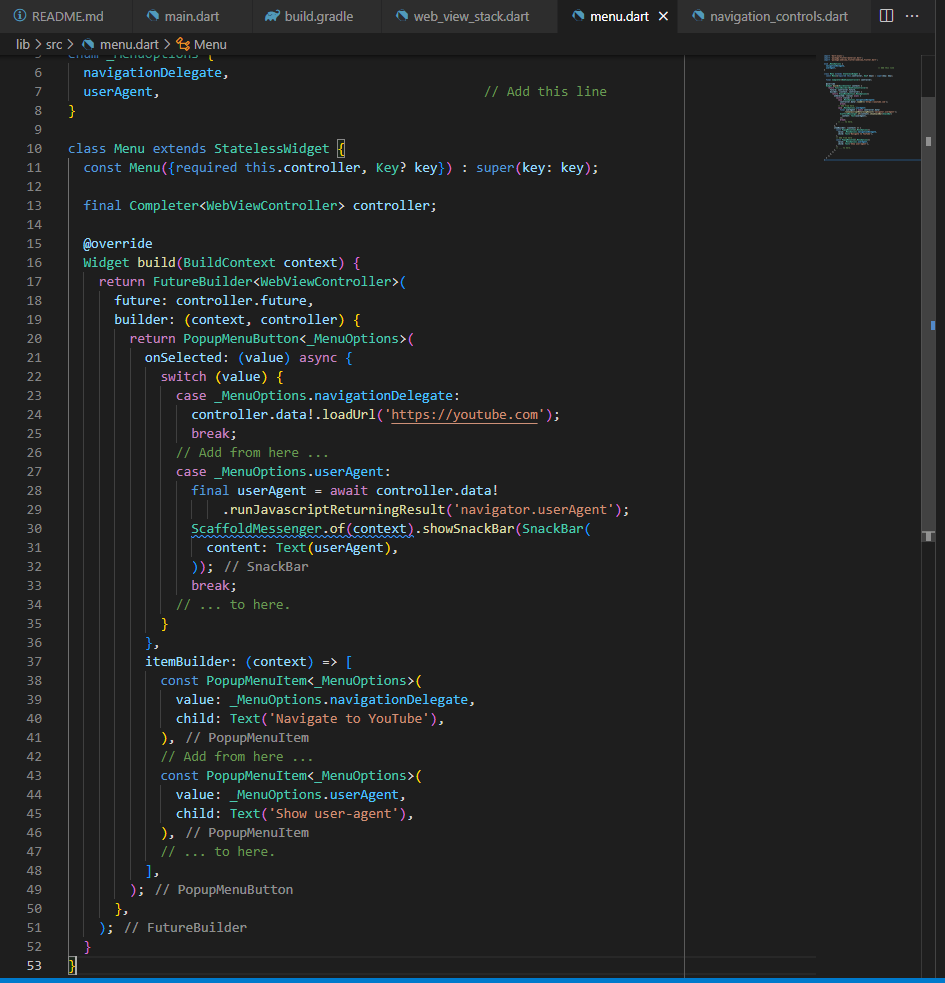

# webview_in_flutter

#26 | Plugin WebView Flutter

## Praktikum 1 : Menambahkan plugin WebView Flutter sebagai dependensi

Menambahkan plugin webview_flutter dengan menjalankan perintah sebagai berikut:

```flutter pub add webview_flutter```


## Praktikum 2 : Mengonfigurasi Android minSDK

Untuk menggunakan plugin webview_flutter di Android perlu menetapkan minSDK ke 19 atau 20, bergantung pada Tampilan Platform Android yang ingin Anda gunakan


## Praktikum 3 : Menambahkan widget WebView ke Aplikasi Flutter

Menampilkan Webview di layar dengan mengganti lib/main.dart


- Pada halaman main.dart ini akan menampilkan halaman dari class WebViewApp yang menggunakan StatefulWidget

- Pada class _WebViewAppState terdapat widget WebView dengan menambahkan parameter initialUrl untuk memanggil url yang akan ditampilkan pada project ini

## Praktikum 4: Mengaktifkan Komposisi Hybrid

- Menambahkan import dengan perintah sebagai berikut:

``` import 'dart:io'; ```


- Menambahkan initState pada class _WebViewAppState


## Praktikum 5: Menjalankan Aplikasi

- Menjalankan aplikasi dengan menjalankan perintah sebagai berikut:

``` flutter run ```


## Praktikum 6: Memproses peristiwa pemuatan halaman

1. Menambahkan peristiwa pemuatan halaman ke aplikasi dengan membuat file baru pada lib/src/web_view_stack.dart sebagai berikut:


- Pada file ini terdapat perintah onPageStarted dengan menetapkan loadingPercentage = 0; 
- Pada file ini terdapat perintah onProgress dengan menetapkan loadingPercentage = progress;
- Pada file ini terdapat perintah onPageFinished dengan menetapkan loadingPercentage = 100;
- Pada file ini juga terdapat statement if apabila loadingPercentage < 100 maka value dari loadingPercentage akan dibagi dengan 100.0

2. Untuk memanfaatkan widget WebViewStack baru ini, ubah lib/main.dart Anda sebagai berikut:


## Praktikum 7: Menggunakan WebViewController

1. Mengakses WebViewController dari Widget WebView dengan mengupdate file web_view_stack.dart sebagai berikut:


- Pada file ini menambahkan import dart async menggunakan perintah sebagai berikut:

``` import 'dart:async'; ```

- Mengedit konstruktor dari class WebViewStack dengan code sebagai berikut:

``` const WebViewStack({required this.controller, Key? key}) : super(key: key); ```

- Menambahkan atribut controller dengan code sebagai berikut:

``` final Completer<WebViewController> controller; ```

- Menambahkan atribut onWebViewCreated untuk memanggil method webViewController

2. Membuat Kontrol Navigasi dengan membuat file navigation_controls.dart dan diisi code sebagai berikut:


3. Menambahkan kontrol navigasi ke AppBar dengan menambahkan beberapa perintah pada file main.dart


- Pada file ini akan menampilkan icon arrow_back_ios yang memiliki fungsi button untuk mengembalikan halaman sebelumnya. Pada button ini juga memiliki statement if else apabila tidak ada halaman yang dikembalikan maka akan menampilkan pesan 'No back history item'

- Pada file ini akan menampilkan icon arrow_forward_ios yang memiliki fungsi button untuk masuk ke halaman selanjutnya. Pada button ini juga memiliki statement if else apabila tidak ada halaman yang dikembalikan maka akan menampilkan pesan 'No back history item'

- Pada file ini akan menampilkan icon replay yang memiliki fungsi button untuk mengulang halaman tersebut.

4. Hasil running


## Praktikum 8: Melacak navigasi dengan NavigationDelegate

1. Mendaftarkan NavigationDelegate kustom dengan menambahkan code pada web_view_stack.dart sebagai berikut:


- Pada file ini menambahkan method untuk navigasi url. Pada method ini terdapat statement if apabila terdapat url youtube.com akan menampilkan snackbar 'Blocking navigation to $host'

## Praktikum 9: Menambahkan tombol menu ke AppBar

1. Menambahkan file menu.dart


- Pada file ini terdapat class Menu dengan menerapkan stateless widget. Pada file ini akan membuat PopupMenuButton yang akan mengarahkan pada url 'https://youtube.com' dan pada popup menu ini akan menampilkan text 'Navigate to YouTube'

2. Menambahkan dan mengimport menu.dart pada main.dart


3. Hasil Running


- Pada halaman ini akan menampilkan button titik tiga dan menampilkan popup menu dengan pesan 'Navigate to Youtube' yang berisikan link youtube


- Pada halaman ini akan menampilkan pesan snackbar ketika pengguna meng-klik popup menu tersebut

## Praktikum 10: Mengevaluasi JavaScript

1. Update class _WebViewStackState dengan menambahkan setelan javascriptMode sebagai berikut:


- Untuk mengaktifkan JavaScript, harus mengonfigurasi widget WebView dengan properti javaScriptMode yang disetel ke JavascriptMode.unrestricted. Secara default, javascriptMode disetel ke JavascriptMode.disabled.

2. Menambahkan code pada menu.dart untuk menambahkan opsi popup menu



- Pada file ini terdapat statement switch case yang dimana bila tidak memilih popup menu yang akan memuat link youtube, maka pengguna dapat memilih popup menu yang lainnya yang berisikan tentang JavascriptReturningResult.

3. Hasil Running


-  Pada halaman ini akan menampilkan popup menu yang berisikan 2 menu, yaitu menu youtube dan menu javascript. 


- Pada halaman ini akan menampilkan pesan Snackbar ketika pengguna memilih menu popup 'Show user-agent'